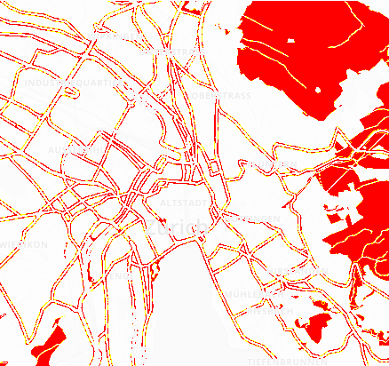
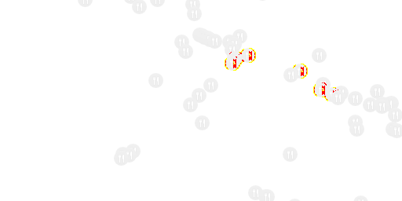

## pixelmatch

[](https://travis-ci.org/mapbox/pixelmatch)
[](https://coveralls.io/github/mapbox/pixelmatch?branch=master)

The smallest, simplest and fastest JavaScript pixel-level image comparison library,
primarily designed to be used in regression tests that compare screenshots.

Features [anti-aliased pixels detection](http://www.ee.ktu.lt/journal/2009/7/25_ISSN_1392-1215_Anti-aliased%20Pxel%20and%20Intensity%20Slope%20Detector.pdf)
and [perceptual color metrics](https://en.wikipedia.org/wiki/YUV).

Inspired by [Resemble.js](https://github.com/Huddle/Resemble.js)
and [Blink-diff](https://github.com/yahoo/blink-diff).
Unlike these libraries, pixelmatch is around **120 lines of code**,
has **more accurate* anti-aliasing detection, **no dependencies**,
and works on **raw arrays** of image data,
so it's **blazing fast** and can be used in **any environment** (Node or browsers).

```js
var numDiffPixels = pixelmatch(img1.data, img2.data, diff.data, 800, 600);
```

### Example output

| expected | actual | diff |
| --- | --- | --- |
|  |  |  |
|  |  |  |

### API

#### pixelmatch(img1, img2, output, width, height[, threshold, includeAA])

- `img1`, `img2` — Image data of the images to compare (`Buffer` or `Uint8Array`).
- `output` — Image data to write the diff to.
- `width`, `height` — Width and height of the images. Note that all three images need to have the same dimensions.
- `threshold` — Matching threshold, ranges from `0` to `1`. Smaller values make the comparison more sensitive. `0.005` by default.
- `includeAA` — If `true`, disables detecting and ignoring anti-aliased pixels. `false` by default.

Compares two images, writes the output diff and returns the number of mismatched pixels.

### Command line

Pixelmatch comes with a binary that works with PNG images:

```bash
pixelmatch image1.png image2.png output.png 0.005
```

### Install

Install with NPM:

```bash
npm install pixelmatch
```

To build a browser-compatible version, clone the repository locally, then run:

```bash
npm install -g browserify
browserify -s pixelmatch index.js > pixelmatch.js
```

### [Changelog](https://github.com/mapbox/pixelmatch/releases)
